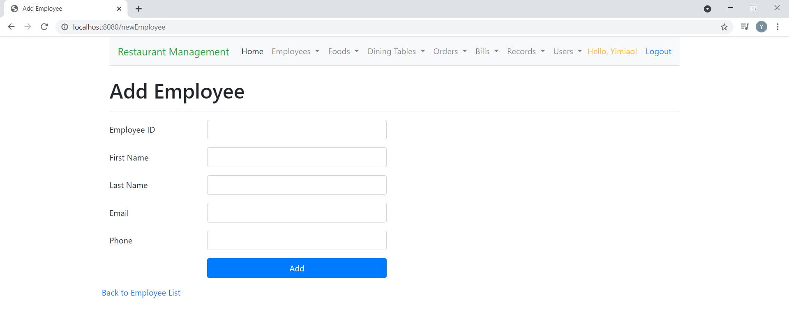
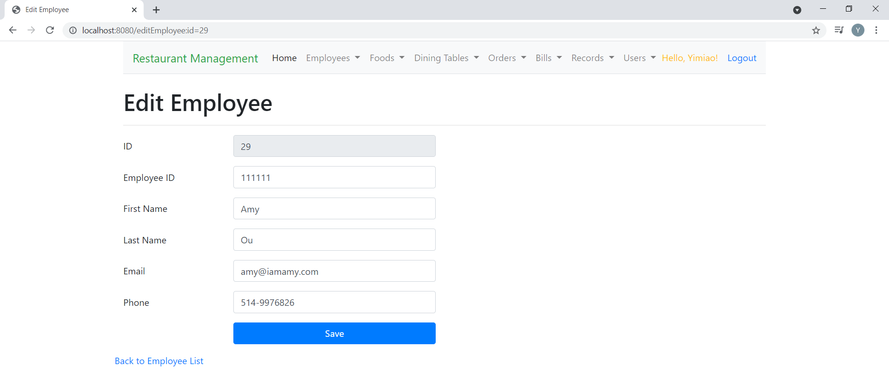
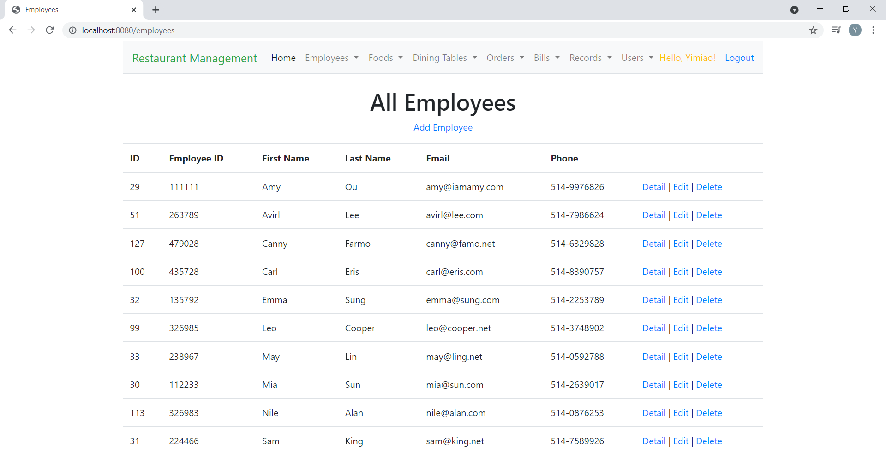
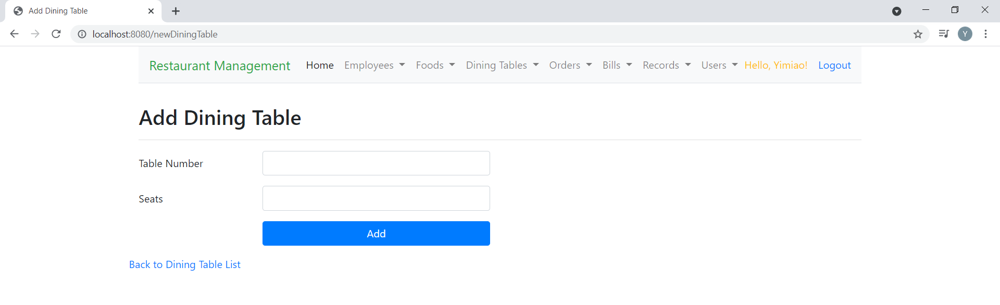
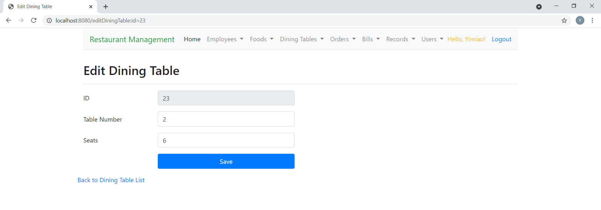
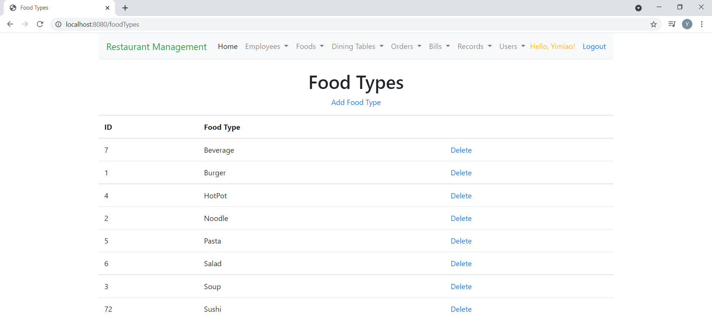
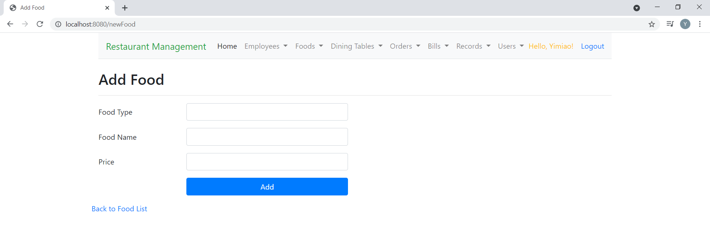
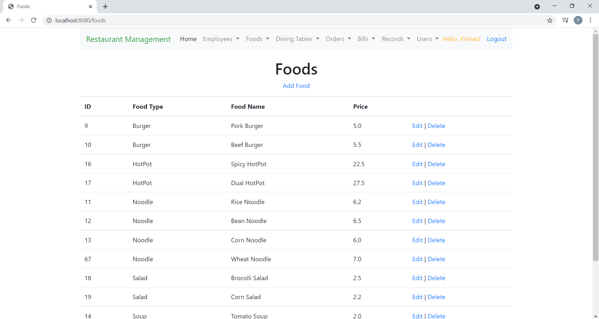
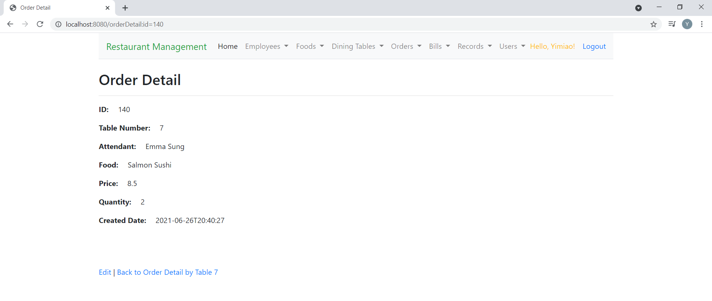
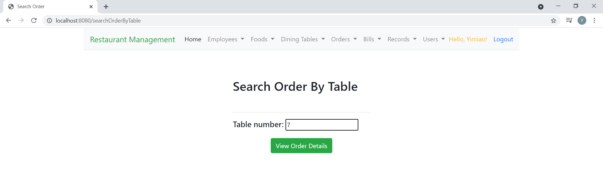

# Spring Boot Restaurant Management Application

<ul>
  <li>Created a restaurant management web application with Java Spring Boot MVC</li>
  <li>The front-end views were created by Java Server Page (<strong>JSP</strong>) using HTML and Bootstrap</li>
  <li>Back-end data was managed by MySQL and used Java Persistence API (<strong>JPA</strong>) as Object Relational Mapper (<strong>ORM</strong>)</li>
</ul>

<h3> Home Page with controllers shown as dropdown lists in the menu bar </h3>

<h3>Employee Controller -- inserting new employee into database</h3>

<h3>Employee Controller -- editing employee info</h3>

<h3>Employee Controller -- viewing all employees. The Add Employee link and the Edit link allows redirecting to the inserting new employee view and the editing employee view respectively. The Delete link directly deletes the employee.</h3>

<h3>DiningTable Controller -- inserting new dining table into database</h3>

<h3>DiningTable Controller -- editing dining table</h3>

<h3>DiningTable Controller -- viewing all dining tables. The Add Dining Table link, Edit link and Delete link allows inserting, editing and deleting the dining table respectively.</h3>

<h3>Food Controller -- inserting new food type into database</h3>

<h3>Food Controller -- viewing all food types. The Add Food Type link redirects to inserting new food type view and the Delete link directly deletes the food type.</h3>

<h3>Food Controller -- inserting new food into database</h3>

<h3>Food Controller -- viewing all foods, with each food belongs to a specific food type. The Add Food link, Edit link and Delete link allows inserting new food, editing food and deleting food respectively.</h3>

<h3>Food Controller -- editing food</h3>

<h3>Order Controller -- inserting new food order for a specific dining table. The table number and attendant name can be selected from the dropdown lists. Both the food type list and food name list are cascading dropdowns. A selected food type will trigger foods that belong to this food type to populate in the food name dropdown. When a certain food name is chosen its price will be automatically filled in the price field. The View Order Detail button allows viewing the order details of the provided dining table number.</h3>

<h3>Order Controller -- viewing the order details of a specific dining table. In addition to the above View Order Detail request, the Search Order action can also lead to this page. The Add Order link, Detail link, Edit link, and Delete link allows inserting new order, viewing ordered food, editing ordered food and deleting ordered food respectively. If there is no question about the order for this specific dining table we can type in the table number and submit the order. The order needs to be submitted again whenever the order details are changed.</h3>

<h3>Order Controller -- viewing one ordered food of a specific dining table. The Edit link allows editing this ordered food and the Back To Order Detail by Table link allows redirecting to the order details of the specific dining table.</h3>

<h3>Order Controller -- editing one ordered food of a specific dining table</h3>

<h3>Order Controller -- searching for order details of the provided table number</h3>

<h3>An error message will show up if currently there is no active order for the searched table</h3>

<h3>Order Controller -- viewing the order summary of all active orders. The Add Order link, Detail link, Edit link and Delete link allows inserting new order, viewing ordered food details, editing order summary and deleting order summary respectively.
</h3>

<h3>Bill Controller -- searching the bill of a specific table. An error message will show up if the searched table doesn't exist or currently there is no active order for the searched table.
</h3>

<h3>Bill Controller -- viewing the bill details returned by bill search. If there is no question about the bill we can press the Pay Bill button to request bill payment.</h3>

<h3>Record Controller -- viewing the order summary of all paid and unpaid orders.</h3>

<h3>Record Controller -- viewing the ordered food details of all paid and unpaid orders. The Order ID for the ordered food of a specific dining table is 0 before bill payment and will be assigned to each of its ordered food after paying the bill.</h3>

